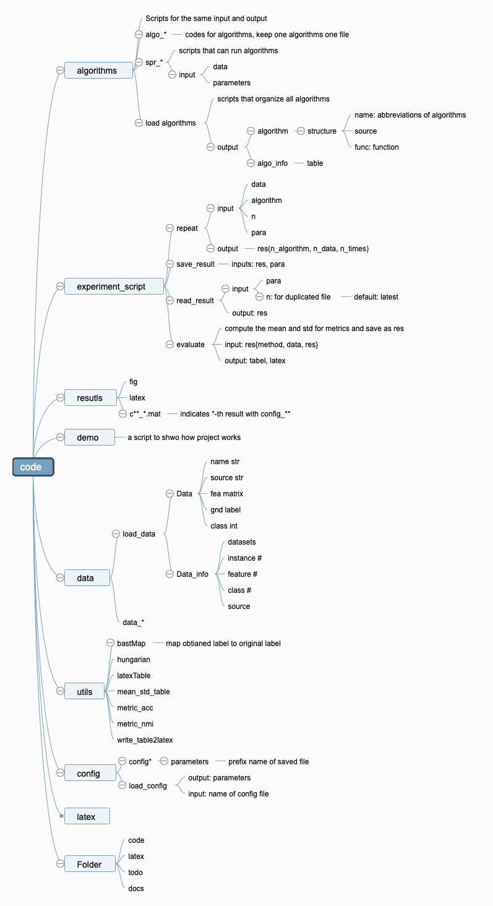

# A matlab project template for clustering research

The structure and functions of this project are shown in this mindmap.

I give an example to compare six common clustering methods with two samll datasets in this project.

If you want to compare any clustering algorithm on any datasets, what you need to do are:

- [ ] replace the algorithms code and the scripts in "algorithm" folder.
- [ ] modify "load_algorithms.m" function to read your algorithm scripts

- [ ] place datasets in "data" folder 
- [ ] modify "load_data.m" to load your datasets

- [ ] Simliarly, modify the files in "config" folder"

- [ ] Finnaly, modify the demo scripts to run all experiment
